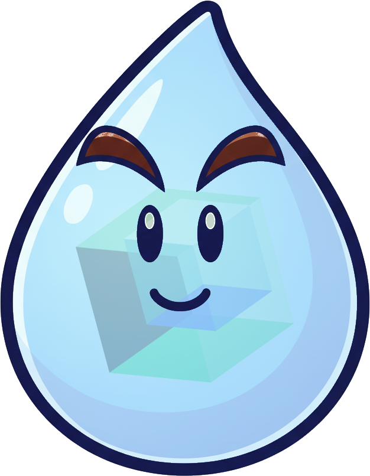

# Deep Research On Premise (DROP) Agent

Deep Research agent designed to work fully on-premise. It uses local models so no data leaves your local network. It
can use tools to browse the internet if given permission to do so. 

To use it, see install instruction below, then just go
to a folder you want to work on and type

    droplet

this will activate the command line agent which will summarize the content of the current folder and given you some
options to start doing deep research

 

## Install

Install via pip (needs at least Python 3.12):

    pip install git@github.com:IBM/drop-agent.git

### Ollama Back-End

If you want to use Ollama as your backend (good option for local laptop usage), install the Ollama server:

    brew install ollama

To start Ollama now and restart at login:

    brew services start ollama

### vLLM Back-End

If you have access to a vLLM server, run droplet with the vLLM backend:

    droplet -b vllm -m $MODEL -u http://${HOSTNAME}:${PORT}

if you have to launch vLLM yourself, you would run on $HOSTNAME

    vllm serve $MODEL --host 0.0.0.0 --port $PORT

if you serve the command above from a network only accessible through a login node to your laptop, on your laptop leave open

    ssh -L ${PORT}:0.0.0.0:${PORT} ${USER}@${HOSTNAME}

and then on another window of your laptop

    droplet -b vllm -m $MODEL -u http://localhost:${PORT}

you can also use e.g. `--save-config remote-vllm` to store this config (with that port) for later use, with

    droplet -c remote-vllm

any further arguments will override the defaults above

## Developer Install

Clone and install in editable mode (here `uv` is used, but pip works too):

    git clone git@github.ibm.com:generative-computing/drop-agent.git
    cd drop-agent
    uv venv -p 3.12
    source .venv/bin/activate
    uv pip install --editable .

